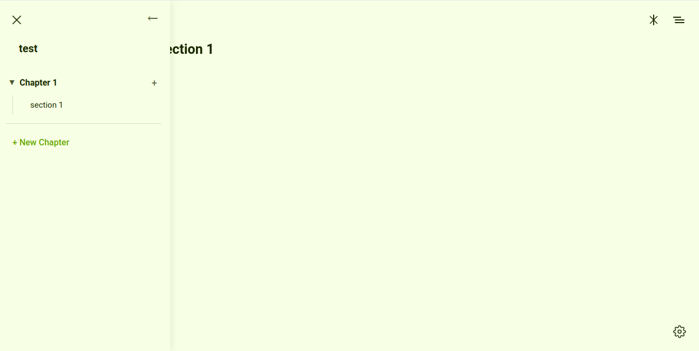

# Editor App

**A modern, offline-first, block-based text editor for writers and researchers, designed for focused, uninterrupted work.**

Editor App is a powerful writing environment that combines a minimalist, distraction-free interface with advanced features like a hierarchical document structure, a personal notebook, and AI-powered assistance. It is built to work seamlessly offline, saving all your data locally in the browser, with optional Google Drive backup for recovery.


*(Replace with an actual screenshot of your application)*

## Table of Contents

- [Editor App](#editor-app)
  - [Table of Contents](#table-of-contents)
  - [Core Features](#core-features)
  - [Getting Started](#getting-started)
    - [Prerequisites](#prerequisites)
    - [Local Installation \& Setup](#local-installation--setup)
    - [Configuration](#configuration)
  - [How to Use the Editor](#how-to-use-the-editor)
    - [The Navigator Panel](#the-navigator-panel)
    - [Hierarchical Structure](#hierarchical-structure)
    - [Editing Content](#editing-content)
  - [Keyboard Shortcuts](#keyboard-shortcuts)
  - [Advanced Features](#advanced-features)
    - [AI Assistant](#ai-assistant)
    - [Personal Notebook](#personal-notebook)
    - [Data Management](#data-management)
  - [Technology Stack](#technology-stack)

## Core Features

*   **Offline-First:** Your work is always saved locally to your browser's database. No internet connection is required to write, edit, or access your documents.
*   **Hierarchical Document Structure:** Organize your work into books, chapters, and sections. The editor's unique save engine allows you to restructure your documents on the fly simply by editing headings.
*   **Distraction-Free Writing:** A clean, minimalist interface that puts your content front and center.
*   **Personal Notebook:** A separate, searchable space for jotting down ideas, research notes, and snippets that aren't yet part of a main document.
*   **AI-Powered Tools:** (Optional) Connect your own API key to leverage powerful AI models for text analysis and rewriting suggestions.
*   **Data Portability:** Easily export your entire library for local backup or export individual documents to `.docx` and LaTeX (`.tex`) formats.
*   **Cloud Backup:** (Optional) Connect your Google Drive account to create a secure, user-visible backup of your application data for disaster recovery.

## Getting Started

Follow these instructions to get a copy of the project up and running on your local machine for development and testing purposes.

### Prerequisites

*   **Node.js:** Make sure you have Node.js (version 18 or newer) and npm installed.
*   **Web Browser:** A modern web browser that supports IndexedDB and Service Workers (e.g., Chrome, Firefox, Edge).

### Local Installation & Setup

1.  **Clone the Repository**
    ```bash
    git clone <your-repository-url>
    cd editor-app
    ```

2.  **Navigate to the Frontend Directory**
    The project is contained within the `frontend` directory.
    ```bash
    cd frontend
    ```

3.  **Install Dependencies**
    This will install all the necessary packages defined in `package.json`.
    ```bash
    npm install
    ```

4.  **Run the Development Server**
    This command starts the Vite development server.
    ```bash
    npm run dev
    ```
    The terminal will display a local URL (usually `http://localhost:5173`). Open this URL in your web browser to see the application running.

### Configuration

To enable the optional AI and Google Drive features, you need to create a `.env` file in the `frontend` directory.

1.  Create a file named `.env` in `frontend/`.
2.  Add the following variables, replacing the placeholder values with your own keys:

    ```env
    # .env

    # For Google Drive Backup
    VITE_GOOGLE_API_KEY=YOUR_GOOGLE_CLOUD_API_KEY
    VITE_GOOGLE_CLIENT_ID=YOUR_GOOGLE_OAUTH_CLIENT_ID.apps.googleusercontent.com

    # For AI Features (Google Gemini)
    # This key is used for AI text generation.
    # Note: This is separate from the Google Cloud API Key.
    VITE_GEMINI_API_KEY=YOUR_GEMINI_API_KEY
    ```
    *(Note: The Gemini API Key is now set directly in the application's settings panel, so this variable may be deprecated.)*

## How to Use the Editor

### The Navigator Panel

The Navigator is your central hub for managing all your documents. Open it using the hamburger icon (`☰`) in the top-left corner or with the `Ctrl/Cmd + B` shortcut.

*   **Library View:** See all your "books" or top-level documents. From here you can create new documents, delete existing ones, or set a "pinned" document that loads by default.
*   **Contents View:** Once you select a document, the navigator shows its hierarchical structure of chapters and sections. Click on any item to load it into the editor.

### Hierarchical Structure

The editor's most powerful feature is its ability to understand structure.

*   `Heading 2` (`##`) represents a **Chapter**.
*   `Heading 3` (`###`) represents a **Section**.

You can create, split, merge, and rename chapters and sections directly within the editor just by manipulating these headings.

*   **To Split a Chapter:** While editing a chapter, add a new `Heading 2`. Everything below it will become a new chapter.
*   **To Merge Chapters:** Delete the `Heading 2` of a chapter. Its content and sections will be automatically merged into the chapter above it.
*   **The same logic applies to Sections** using `Heading 3`.

### Editing Content

*   **Views:** You can edit a single section or an entire chapter at once. Click on the desired item in the Navigator to load its "view."
*   **Saving:** Your work is saved automatically every 10 seconds. You can also manually save at any time using the `Ctrl/Cmd + S` shortcut.

## Keyboard Shortcuts

| Shortcut | Action |
| :--- | :--- |
| `Ctrl` / `Cmd` + `S` | Manually save the current view. |
| `Ctrl` / `Cmd` + `K` | Open the Command Palette (for AI actions). |
| `Ctrl` / `Cmd` + `F` | Open the global Search panel. |
| `Ctrl` / `Cmd` + `B` | Toggle the Navigator panel. |
| `Ctrl` + `Enter` | Execute command in Command Palette or Notebook. |
| `Esc` | Close any open modal or palette. |

## Advanced Features

### AI Assistant

Open the AI Assistant using the spark icon (`✨`) in the top-right.

1.  **Configure:** Go to Settings (`⚙️`) -> AI Settings and enter your API key for either Google Gemini or Anthropic Claude.
2.  **Use:** Select a piece of text in the editor and press `Ctrl/Cmd + K` to open the Command Palette.
    *   **Analyze:** Get a detailed analysis of the selected text based on your prompt. The result appears as a note in the Assistant panel.
    *   **Rewrite:** Ask the AI to rewrite your selected text. The result is presented as a "diff" view, which you can accept to replace your original text.

### Personal Notebook

Open the Notebook using the pages icon (`📖`) in the top-right. This is a separate space for unstructured notes.
*   Notes are saved locally and are fully searchable.
*   You can pin important notes to keep them at the top of the list.

### Data Management

All data management options are available in the Settings (`⚙️`) panel under the "Data Management" tab.

*   **Local Backup:** Export your entire local database to a single `.json` file for backup. You can import this file on another machine to restore your data.
*   **Cloud Backup (Google Drive):** Connect your Google account to back up your data to a dedicated `Editor App App Data` folder in your Google Drive. This is a simple backup/restore mechanism, not a real-time sync.
*   **Document Export:** Export individual documents to `.docx` (Microsoft Word) or `.tex` (LaTeX) formats.
*   **Uninstall:** A "Disconnect & Reset" option is available to completely wipe all application data from your browser, including service workers and the database.

## Technology Stack

*   **Core:** Vanilla JavaScript (ES Modules)
*   **Editor:** [TipTap](https://tiptap.dev/) (a headless, block-based editor framework)
*   **Local Storage:** IndexedDB (via a custom `StorageService` wrapper)
*   **Frontend Tooling:** [Vite](https://vitejs.dev/)
*   **Search:** [FlexSearch](https://github.com/nextapps-de/flexsearch)
*   **Styling:** Plain CSS with CSS Variables for theming.